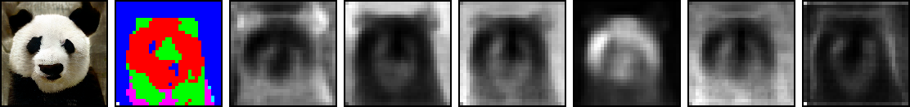
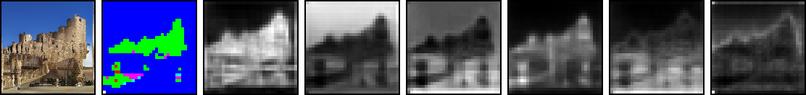

# [Attentive Normalization for Conditional Image Generation](https://arxiv.org/pdf/2004.03828.pdf) [[Slides](./media/213-talk.pdf)] [[Video](https://drive.google.com/open?id=12DnbF4DCEyKU8adZ67G9gWHhL9lrqh5c)][[Supp](./media/00213-supp.pdf)]
by [Yi Wang](https://shepnerd.github.io/), [Ying-Cong Chen](https://yingcong.github.io/), [Xiangyu Zhang](), [Jian Sun](http://www.jiansun.org/), [Jiaya Jia](http://jiaya.me/). **The code will be released**.

## Introduction
This repository gives the PyTorch implementation of the method in CVPR 2020 paper, '[Attentive Normalization for Conditional Image Generation](https://arxiv.org/pdf/2004.03828.pdf)'. This paper studies conducting visual long-range dependency modeling in an normalization manner, verified both in class-conditional image generation and image inpainting tasks. 

## Framework
We __normalize__ the input feature maps __spatially__ according to the __semantic layouts__ predicted from them. It improves the distant relationship in the input as well as preserving semantics spatially.


Our method is built upon instance normalization (IN). It contains semantic layout learning module (semantic layout prediction + self-sampling regularization) and regional normalization.

<!--



The above figure gives the visualization of the learned semantic layout on ImageNet. 1st column: Class-conditional generation results from our method. 2nd column: Binary version of the learned semantic layout. Other columns: Attention maps activated by the learned semantic entities. The brighter the activated regions
are, the higher correlation they are with the used semantic entity.
-->

<!--
### Regional normalization
```
S = tf.expand_dims(S, -2) # shape: b x h x w x 1 x n
c = tf.reduce_sum(S, axis=[1,2], keepdims=True) + eps
X = tf.expand_dims(X, -1) # b x h x w x c x 1
X_act = X * S # b x h x w x c x n
X_m = tf.reduce_sum(X_act, axis=[1,2], keepdims=True) / c
X_d = tf.sqrt(tf.reduce_sum((X_act-X_m)**2, axis=[1,2], keepdims=True)/c)
Xn = (X - X_m) / (X_d + eps) * beta + alpha
Xn = tf.reduce_sum(X * S, axis=-1)
```
-->

## Applications
This module can be applied to the current GAN-based conditional image generation tasks, e.g., class-conditional image generation and image inpainting.


In common practice, Attentive Normalization is placed between the convolutional layer and the activation layer. In the testing phase, we remove the randomness in AttenNorm by switching off its self-sampling branch. Thus, the generation procedure is deterministic only affected by the input.

<!--
## Prerequisites
- Python3.5 (or higher)
- PyTorch 1.6 (or later versions) with NVIDIA GPU or CPU
- OpenCV
- numpy
- scipy
- easydict


### Datasets
- Paris-Streetview ([https://github.com/pathak22/context-encoder](https://github.com/pathak22/context-encoder)).


## Disclaimer

## References

-->

## Citation

If our method is useful for your research, please consider citing:

    @article{wang2020attentive,
      title={Attentive Normalization for Conditional Image Generation},
      author={Wang, Yi and Chen, Ying-Cong and Zhang, Xiangyu and Sun, Jian and Jia, Jiaya},
      journal={arXiv preprint arXiv:2004.03828},
      year={2020}
    }

<!--
## Acknowledgments
Our code is built upon [Self-Attention-GAN](https://github.com/heykeetae/Self-Attention-GAN), [SPADE](https://github.com/NVlabs/SPADE), and [Sync-BN](https://github.com/vacancy/Synchronized-BatchNorm-PyTorch).
-->

### Contact
Please send email to yiwang@cse.cuhk.edu.hk.
